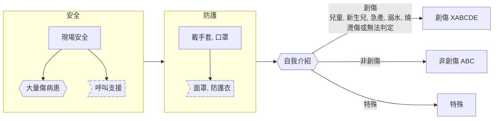
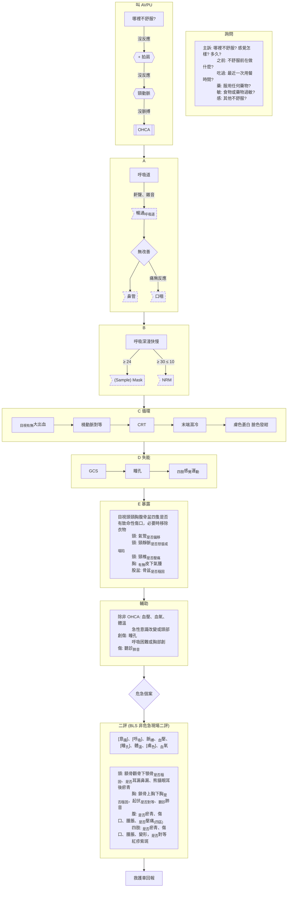
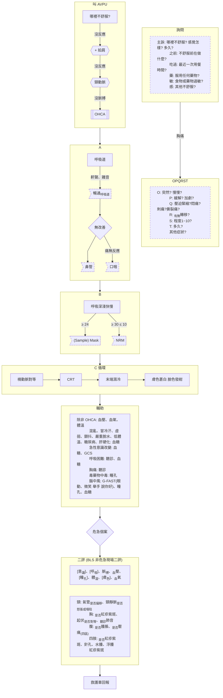
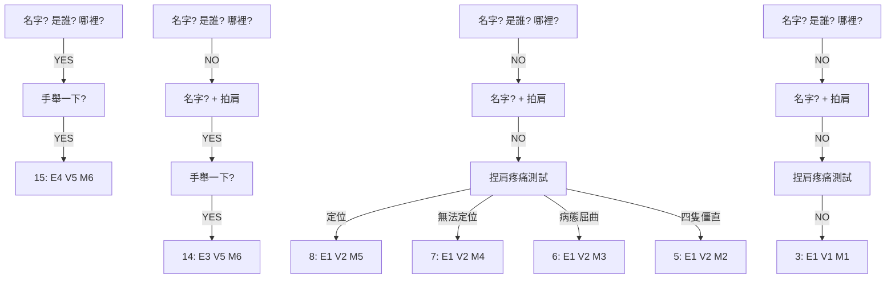

# emt

## 處置流程

基本

創傷

非創傷

火災

## 評估方式

### 初步評估

### 創傷流程

### 非創流程

### 危急個案

- 生命徵象
    - GCS < 14
    - 呼吸次數(RR) ≥ 5 OR < 1.6666 / 10s
    - 脈搏 > 150 OR < 50
    - 收縮壓 > 200 OR < 90 mmHg
    - 微血管充填時間(CRT) > 2s
    - 體溫(BT) > 41 OR < 32°C
    - 血氧(SPO2) < 90%
- 創傷部位
    - 體表面積 >25% 或顏面、會陰之 2 度或 3 度燒灼傷
    - 重大的電（雷）擊傷
    - 化學性、吸入性燒灼傷
    - 頭頸軀幹及肘膝處以上肢體之穿刺傷
    - 大量皮下氣腫
    - 氣管支氣管損傷
    - 內臟外露
    - 手腕或腳踝以上之截肢
    - 兩處以上大腿及上臂處長骨骨折、骨盆腔骨折、頭骨開放或凹陷性骨折
    - 肢體脈搏摸不到
    - 癱瘓、壓碎傷或嚴重撕裂傷
- 創傷機轉
    - 高處墜落 > 6 公尺（OR > 2 層樓高）或小兒 > 3 公尺（OR > 身高 2 倍）
    - 脫困時間 > 20 分鐘
    - 身體被車輛輾過(遠端肢體除外)
    - 從車輛中被拋出、同車有死亡者或其他有高能量撞擊
- 特殊情況
    - 血糖 < 60mg/dl 或 ≥ 500mg/dl
    - 疑似急性腦中風或缺血性胸痛
    - 當病患連續抽搐超過 5 分鐘，或在 5 分鐘內有2次發作且意識未能恢復（癲癇重積，應立刻請求支援）
    - 中毒可能危及生命
    - 小兒評估三角異常者
    - 急產或已經完成接生
    - 毒蛇咬傷
    - 溺水

### 燒燙傷
成人：頭上肢 9%、前後軀幹及下肢 18%、外陰 1%
兒童：頭 18%、下肢 14%

### GCS

- 語言：錯誤 V4、單詞 V3、聲音 V2
- ≦ 8? 7? 意識昏迷

## 單項處置技術